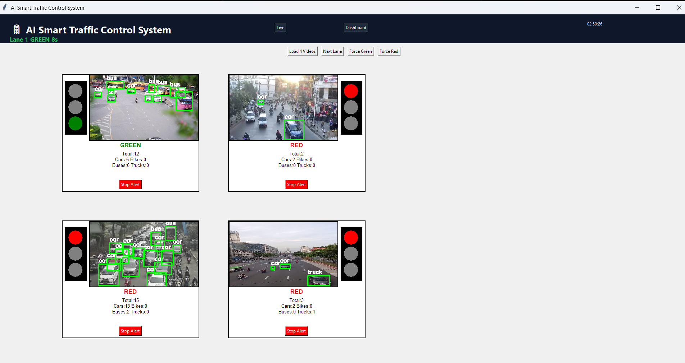
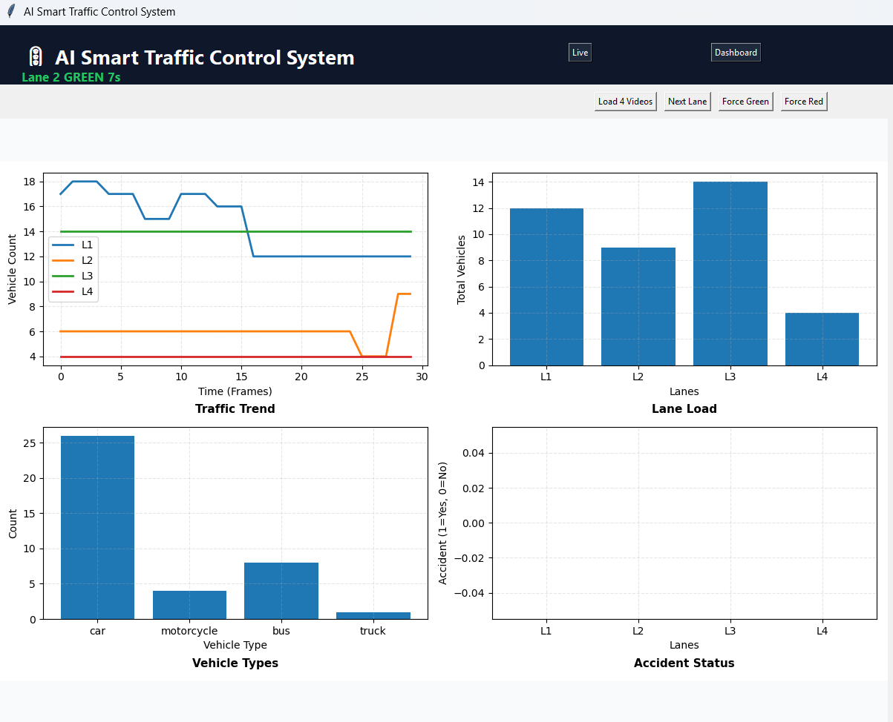
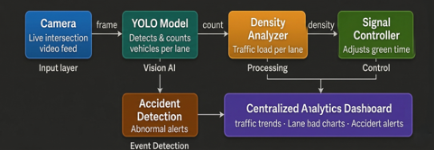

# 🚦 AI Smart Traffic Control System

An AI-based traffic management system that uses computer vision to detect, count, and analyze vehicles in real-time, and dynamically control traffic signals based on lane density.

---

## 🚀 Features

* 🎥 Real-time traffic monitoring using video input
* 🤖 Vehicle detection using YOLO model
* 📊 Lane-wise vehicle counting and analysis
* 🚦 Dynamic traffic signal control (Green/Red timing)
* ⚠️ Basic accident detection and alerts
* 📈 Live analytics dashboard (traffic trends, lane load, vehicle types)

---

## 🛠️ Tech Stack

* Python
* OpenCV
* YOLO (Object Detection)
* NumPy / Matplotlib
* (Optional: Tkinter / Streamlit for UI)

---

## 📂 Project Structure

ai_traffic_system/
│── main.py
│── yolo_model/
│── utils/
│── videos/
│── dashboard/
│── README.md

---

## ▶️ How to Run

1. Clone the repository:
   git clone https://github.com/PIYUSHSRI053/voting_system.git
   cd voting_system

2. Install dependencies:
   pip install -r requirements.txt

3. Run the project:
   python main.py

---

## 🧠 How It Works

* Camera feeds are processed using YOLO for vehicle detection
* Vehicles are counted lane-wise
* Density analyzer calculates traffic load
* Signal controller adjusts green time dynamically
* Dashboard displays live analytics and trends

---

## 🖼️ System Architecture

---

## 📸 Output

### 🔴 Live Traffic Detection & Signal Control

### 📊 Analytics Dashboard

### 📈 Traffic Trends & Lane Analysis

---

## ⚠️ Limitations

* Accuracy depends on video quality
* No advanced accident detection model
* Not deployed on real hardware signals
* Limited scalability

---

## 🔮 Future Improvements

* Deploy on real-time traffic systems
* Improve accident detection using deep learning
* Cloud deployment (AWS / Azure)
* Mobile/web dashboard
* Integration with smart city infrastructure

---

## 📌 Use Case

* Smart city traffic management
* Congestion reduction
* Real-time monitoring and analytics

---

## 👨‍💻 Author

Piyush Sri
GitHub: https://github.com/PIYUSHSRI053

---

## ⭐ Support

If you like this project, give it a star ⭐
